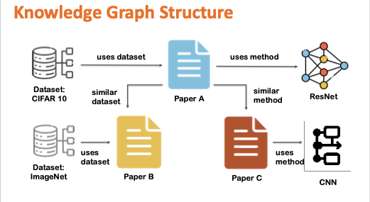

# Scientific Research Assistant using Knowledge Graph + RAG

A research assistant pipeline that collects papers, builds semantic search + knowledge graph context, and answers researcher-style questions using retrieval augmented generation (RAG).

## What This Project Does

The system follows this workflow:

1. Fetch CS paper metadata from ArXiv
2. Download full PDFs and parse section-aware text
3. Chunk and embed papers for semantic retrieval
4. Build a knowledge graph from extracted entities
5. Compare semantic-only retrieval vs hybrid (semantic + graph) retrieval
6. Generate natural-language answers using retrieved evidence and an LLM

## Architecture



## Repository Layout

- `ScientificResearchAssistant/` - pipeline and retrieval scripts
- `ScientificResearchAssistant/requirements.txt` - Python dependencies
- `Dockerfile` - app container image
- `docker-compose.yml` - app + Redis Stack

## Prerequisites

- Python 3.11+ (3.12 recommended)
- Redis Stack (`redis/redis-stack-server`)
- Optional (for Claude-based scripts):
  - `ANTHROPIC_API_KEY`

## Quick Start (Local)

From repository root:

```bash
python3 -m venv .venv
source .venv/bin/activate
pip install -r ScientificResearchAssistant/requirements.txt
python -m nltk.downloader punkt stopwords
cd ScientificResearchAssistant
```

Set env vars (if needed):

```bash
export REDIS_HOST=localhost
export REDIS_PORT=6379
export ANTHROPIC_API_KEY=your_key_here
```

## Pipeline Execution Order

Run from `ScientificResearchAssistant`:

```bash
python fetch_papers_metadata.py
python download_pdfs.py
python parse_full_pdfs.py
python chunk_full_papers.py
python embed_chunks.py
python extract_entities.py
python build_kg_improved.py
python redis_setup.py
```

Or run the full workflow with one command:

```bash
./run_pipeline.sh
```

Optional usage:

```bash
./run_pipeline.sh --query "How do graph neural networks improve recommendation systems?" --top-k 10
./run_pipeline.sh --skip-fetch --skip-download
```

Then query:

```bash
python search_redis.py "knowledge graph rag in manufacturing"
# or
python enhanced_rag.py "How do I implement contrastive learning for recommendations?" --top-k 10
```

## Comparison / Testing

Use this to benchmark semantic-only retrieval vs hybrid retrieval quality:

```bash
python evaluate_search.py
```

## Docker Usage

Build and start:

```bash
docker compose up --build -d redis
docker compose run --rm app
```

Inside container (`/workspace/ScientificResearchAssistant`):

```bash
python fetch_papers_metadata.py
python download_pdfs.py
python parse_full_pdfs.py
python chunk_full_papers.py
python embed_chunks.py
python extract_entities.py
python build_kg_improved.py
python redis_setup.py
python search_redis.py "recommendation systems"
```

## Notes

- First run will take significant time (paper download, parsing, embedding model download).
- Generated data is intentionally not committed (`ScientificResearchAssistant/data/`).
- If you run Claude-based scripts, provide `ANTHROPIC_API_KEY` via environment variable.
